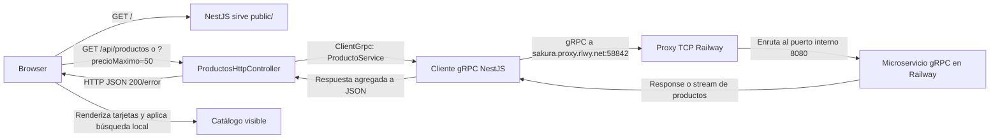

# Auditoría técnica del proyecto

**Fecha:** 2026-09-29  
**Alcance:** backend NestJS/gRPC, puente HTTP, frontend estático, configuración y pruebas presentes en el repositorio. La configuración interna del servicio desplegado en Railway no está incluida en este código y no se auditó.

## Resumen ejecutivo

El proyecto funciona como demostración de catálogo: sirve el frontend, expone una API HTTP y consulta operaciones gRPC en Railway. La interfaz permite listar, filtrar por precio y buscar por nombre o ID. Build, lint y las suites configuradas pasan en el estado revisado.

El principal defecto de corrección está en cómo se traducen errores gRPC a HTTP: una caída o indisponibilidad puede presentarse como un producto inexistente. También hay ambigüedad operativa porque el proceso inicia un servidor gRPC local mientras, por defecto, su cliente apunta al endpoint remoto. La suite llamada e2e no prueba el recorrido real HTTP→gRPC.

**Evaluación:** adecuado para una práctica/prototipo; antes de producción conviene corregir el mapeo de errores, separar o configurar explícitamente los roles cliente/servidor y añadir pruebas de integración. No se encontraron fallos de compilación en las verificaciones ejecutadas.

## Hallazgos

### P2 · Los fallos gRPC se convierten en `404`

En [`src/productos-http.controller.ts`](src/productos-http.controller.ts), el método `GET /api/productos/:id` captura cualquier excepción de `obtenerProducto` y lanza `NotFoundException`. Esto mezcla un ID inexistente con fallos de red, `UNAVAILABLE`, errores de protocolo o problemas del servicio remoto. El consumidor recibe una respuesta incorrecta y el frontend puede sugerir que el producto no existe cuando en realidad Railway no respondió.

**Recomendación:** traducir a `404` únicamente el código gRPC `NOT_FOUND`; propagar otros errores como `502 Bad Gateway` o `503 Service Unavailable`, conservando un mensaje seguro y registrando el detalle en servidor.

### P2 · El proceso combina gateway remoto y servidor gRPC local

[`src/main.ts`](src/main.ts) inicia HTTP y también un servidor gRPC en `0.0.0.0:${GRPC_PORT}` (por defecto `5001`). En cambio, [`src/app.module.ts`](src/app.module.ts) configura el cliente gRPC para `sakura.proxy.rlwy.net:58842` por defecto. Por tanto, el listener gRPC local no atiende las peticiones del frontend en la configuración normal; sólo se usa si `GRPC_URL=localhost:5001`.

Esto dificulta saber qué servicio se está probando y causa `EADDRINUSE` si se inicia una segunda instancia mientras la primera conserva el puerto `5001`.

**Recomendación:** hacer explícito el rol del proceso. Para una app gateway, iniciar sólo HTTP y configurar `GRPC_URL` a Railway. Si también se necesita alojar el servicio gRPC local, habilitarlo mediante una opción de configuración y documentar claramente el modo local.

### P2 · La suite `e2e` no prueba la integración de extremo a extremo

[`test/app.e2e-spec.ts`](test/app.e2e-spec.ts) crea un módulo Nest de pruebas y llama directamente a `AppController`; no arranca HTTP/gRPC ni usa el cliente `PRODUCTOS_GRPC`. Las pruebas unitarias de [`src/app.controller.spec.ts`](src/app.controller.spec.ts) también cubren el controlador servidor local, pero no el puente HTTP ni el frontend. Así, la suite puede pasar aunque el endpoint Railway, el contrato/proto o la conversión HTTP estén rotos.

**Recomendación:** agregar pruebas del `ProductosHttpController` con `ClientGrpc` simulado para validar listado, filtro, `404`, errores de conectividad y validación; opcionalmente agregar una prueba de integración que levante el gateway con un servidor gRPC de prueba local.

### P2 · El transporte gRPC no configura TLS ni autenticación

[`src/main.ts`](src/main.ts) enlaza el servidor gRPC a todas las interfaces y no configura credenciales TLS ni autenticación. [`cliente.js`](cliente.js) también usa `createInsecure()` hacia el endpoint público de Railway. Si ese puerto acepta tráfico externo, las llamadas no tienen cifrado/autorización a nivel de aplicación. El catálogo de muestra no parece contener datos sensibles, así que el impacto actual es limitado; la configuración no debe trasladarse sin revisión a datos privados o un servicio de producción.

**Recomendación:** confirmar qué protección ofrece el proxy de Railway de extremo a extremo. Para información no pública, habilitar TLS entre cliente y servicio y aplicar autenticación/autorización o restringir el acceso de red.

### P3 · Respuestas de búsqueda/filtro pueden llegar fuera de orden

[`public/app.js`](public/app.js) permite iniciar varias llamadas a `loadProducts()` sin cancelar ni identificar solicitudes anteriores. Como la respuesta gRPC es un stream y se agrega antes de responder, una solicitud anterior que tarde más puede reemplazar los resultados de una acción más reciente.

**Recomendación:** cancelar solicitudes anteriores con `AbortController` o ignorar respuestas cuyo identificador ya no sea el más reciente. Es un riesgo menor con el catálogo actual, pero visible si se hacen filtros rápidamente o aumenta la latencia.

## Backend

- El contrato de [`src/productos.proto`](src/productos.proto) define tres operaciones: consulta unaria por ID y dos streams de servidor para listado y filtro por precio.
- [`src/app.controller.ts`](src/app.controller.ts) implementa el servicio gRPC con tres productos almacenados en memoria. No hay persistencia; los datos se reinician con el proceso y son fijos.
- [`src/productos-http.controller.ts`](src/productos-http.controller.ts) adapta el stream gRPC a respuestas JSON y valida que `precioMaximo` sea un número finito no negativo.
- La URL remota es configurable con `GRPC_URL`; el valor por defecto es el proxy público de Railway `sakura.proxy.rlwy.net:58842`. Railway enruta ese puerto al puerto interno `8080` del servicio remoto.
- El servidor gRPC de este proceso usa `GRPC_PORT` (por defecto `5001`) y HTTP usa `PORT` (por defecto `5000`). Son listeners distintos.
- [`src/app.service.ts`](src/app.service.ts) conserva el método de ejemplo `getHello()` y está registrado como provider, aunque no participa en el flujo de productos.

## Frontend

- [`public/index.html`](public/index.html), [`public/app.js`](public/app.js) y [`public/styles.css`](public/styles.css) implementan una SPA ligera sin framework ni paso de compilación frontend; Nest sirve `public/` desde el mismo origen.
- El listado y el filtro de precio se solicitan al backend. La búsqueda por texto y por ID se realiza en el navegador sobre los productos ya cargados.
- Hay estados de carga, error, conexión y lista vacía. Los nombres y mensajes de error dinámicos se escapan antes de insertarse como HTML.
- La UI es de consulta; no permite crear, editar ni eliminar productos, y tampoco usa desde la interfaz la ruta HTTP de detalle por ID. Esto es coherente con el alcance actual de catálogo de lectura, pero no cubre administración CRUD.
- Se verificó manualmente la página en escritorio/móvil: carga los tres productos, el filtro `50` reduce el listado a dos, limpiar restaura los tres y buscar `Mouse` muestra un solo resultado. En el viewport móvil probado no hubo desbordamiento horizontal.

## Verificaciones ejecutadas

| Verificación | Resultado |
| --- | --- |
| `npm run build` | Correcto |
| `npm run lint` | Correcto, sin diagnósticos |
| `npm test` | 1 archivo, 3 pruebas aprobadas |
| `npm run test:e2e` | 1 archivo, 2 pruebas aprobadas; son pruebas del controlador, no e2e de red |
| Navegador | Página, conexión gRPC indicada, búsqueda y filtro comprobados manualmente |

Vitest muestra un aviso informativo de que `vite-tsconfig-paths` puede sustituirse por la resolución nativa de rutas de TypeScript de Vite. No impide las pruebas.

## Flujo de extremo a extremo

El navegador nunca habla gRPC directamente: sólo usa HTTP en el mismo origen. Para listar, el cliente pide `ListarProductos`; para filtrar por precio pide `BuscarPorPrecioMaximo`; para la ruta de detalle se invoca `ObtenerProducto`. Nest convierte la respuesta de gRPC a JSON y `public/app.js` actualiza la vista. El listener local `:5001` iniciado por `main.ts` es un servidor gRPC aparte y no participa en este flujo por defecto; sólo sería el destino si se configura `GRPC_URL=localhost:5001`.
